# Argentina dataset — explore-phase findings

Reproducible evidence behind the four-bucket schema and the master-assembly rule documented in `CONTEXT.md`. Re-run the explore orchestrator to refresh.

## Volatility scan

Per-`idpozo` cross-year `COUNT(DISTINCT)` over the staged production rows. NULLs are excluded; a well is counted as "changed" only if it has more than one distinct non-null value.

| Bucket | Column | Wells changed | Wells w/ value | Total wells | % changed |
| --- | --- | ---: | ---: | ---: | ---: |
| event | `tipoestado` | 63033 | 85301 | 85305 | 73.895% |
| event | `tipoextraccion` | 38450 | 85301 | 85305 | 45.076% |
| event | `tipopozo` | 37929 | 85301 | 85305 | 44.465% |
| scd | `empresa` | 56928 | 85305 | 85305 | 66.735% |
| scd | `idempresa` | 56928 | 85305 | 85305 | 66.735% |
| static | `areapermisoconcesion` | 214 | 85301 | 85305 | 0.251% |
| static | `areayacimiento` | 185 | 85304 | 85305 | 0.217% |
| static | `clasificacion` | 3 | 67102 | 85305 | 0.004% |
| static | `cuenca` | 0 | 85302 | 85305 | 0.000% |
| static | `formacion` | 43 | 82487 | 85305 | 0.052% |
| static | `formprod` | 43 | 82620 | 85305 | 0.052% |
| static | `idareapermisoconcesion` | 245 | 85301 | 85305 | 0.287% |
| static | `idareayacimiento` | 189 | 85304 | 85305 | 0.222% |
| static | `profundidad` | 27 | 85305 | 85305 | 0.032% |
| static | `provincia` | 11 | 85305 | 85305 | 0.013% |
| static | `proyecto` | 0 | 85305 | 85305 | 0.000% |
| static | `sigla` | 208 | 85305 | 85305 | 0.244% |
| static | `sub_tipo_recurso` | 0 | 4757 | 85305 | 0.000% |
| static | `subclasificacion` | 36 | 67102 | 85305 | 0.054% |
| static | `tipo_de_recurso` | 1 | 85305 | 85305 | 0.001% |
| time-series | `iny_agua` | 11778 | 85305 | 85305 | 13.807% |
| time-series | `iny_co2` | 2 | 85305 | 85305 | 0.002% |
| time-series | `iny_gas` | 176 | 85305 | 85305 | 0.206% |
| time-series | `iny_otro` | 60 | 85305 | 85305 | 0.070% |
| time-series | `prod_agua` | 47813 | 85305 | 85305 | 56.049% |
| time-series | `prod_gas` | 40683 | 85305 | 85305 | 47.691% |
| time-series | `prod_pet` | 47381 | 85305 | 85305 | 55.543% |
| time-series | `tef` | 59476 | 85305 | 85305 | 69.722% |
| time-series | `vida_util` | 12387 | 44286 | 85305 | 27.970% |

## Master reconciliation

| Source | Rows | Distinct `idpozo` |
| --- | ---: | ---: |
| capitulo_iv | 85380 | 85380 |
| capitulo_iv_AND_listado | n/a | 84210 |
| capitulo_iv_AND_production | n/a | 85268 |
| listado | 84242 | 84242 |
| listado_AND_production | n/a | 84241 |
| production | 17629663 | 85305 |

- **Production-only wells (absent from capitulo-iv):** 37. See `production_only_wells.parquet`.
- **Capitulo-iv-only orphan wells (never in production):** 112. Emitted with `has_production = false`. See `capitulo_iv_only_orphans.parquet`.

### Field agreement (capitulo-iv vs listado, overlap rows)

| Column | Agreement | Disagreement | Overlap rows |
| --- | ---: | ---: | ---: |
| `clasificacion` | 66273 | 17937 | 84210 |
| `subclasificacion` | 66273 | 17937 | 84210 |
| `sigla` | 84062 | 148 | 84210 |
| `cota` | 84196 | 14 | 84210 |
| `adjiv_fecha_fin_term` | 84207 | 3 | 84210 |
| `adjiv_fecha_inicio_term` | 84207 | 3 | 84210 |
| `cuenca` | 84210 | 0 | 84210 |
| `gasplus` | 84210 | 0 | 84210 |
| `profundidad` | 84210 | 0 | 84210 |
| `provincia` | 84210 | 0 | 84210 |

Trust rule: `capitulo-iv` wins on every overlapping field (regulatory file). The disagreements above — typically concentrated in `sigla` and `cota` — are documented evidence for that rule, not an issue to auto-resolve.

## Gap audit

- Wells in production: **85305**
- Wells with one or more source-month gaps in [first, last]: **16850**
- Maximum gap-count seen on any well: **212**
- Longest single gap seen on any well: **212 months**

These gaps justify the date-completeness rule for `monthly_production` (the time-series destination is gap-filled with NULL measurement rows). The operator-history and event tables preserve the gaps as NULL intervals — there the gap is the data.

## Plots

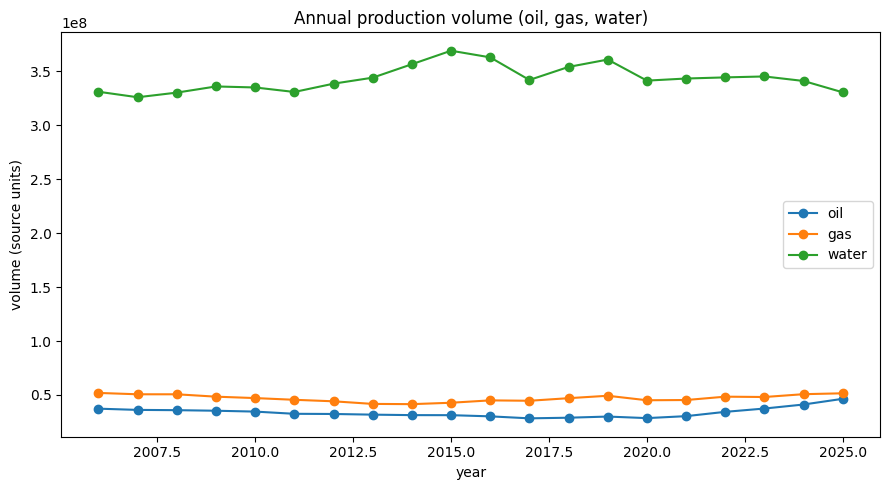
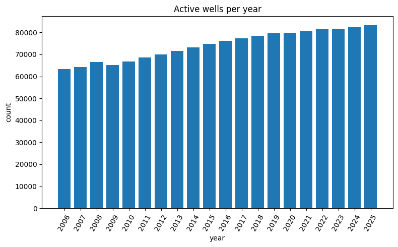
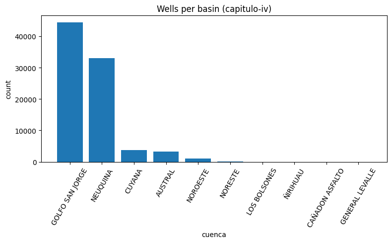
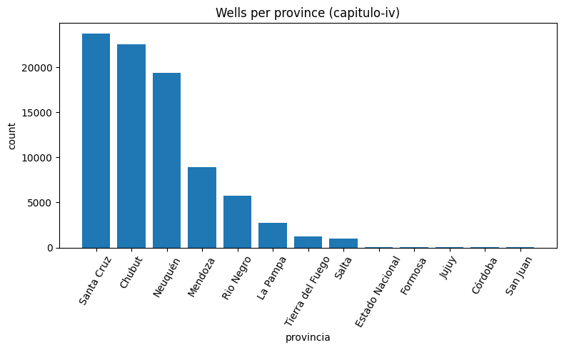
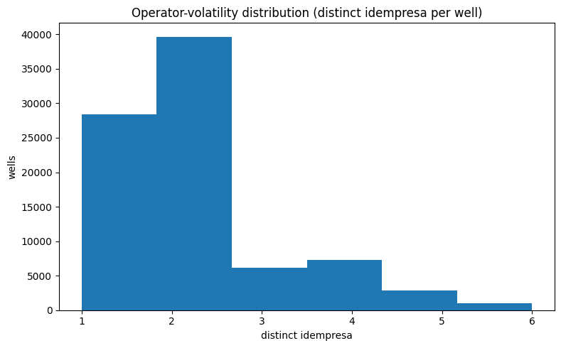
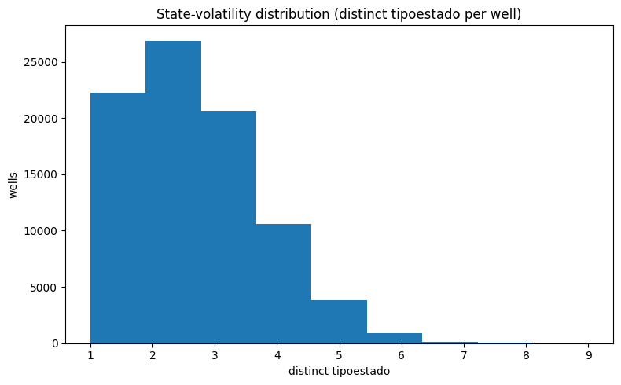
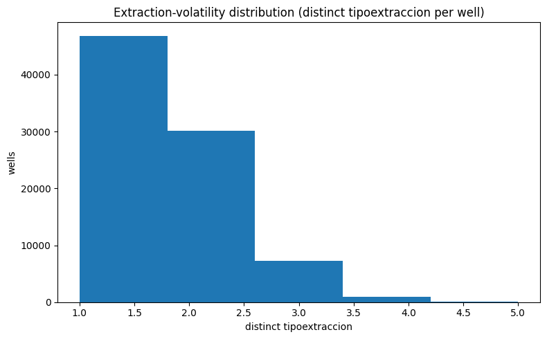
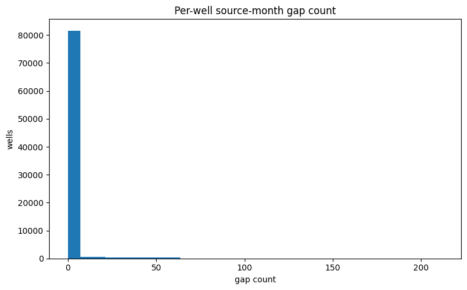
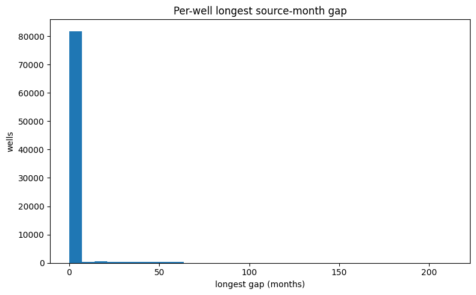
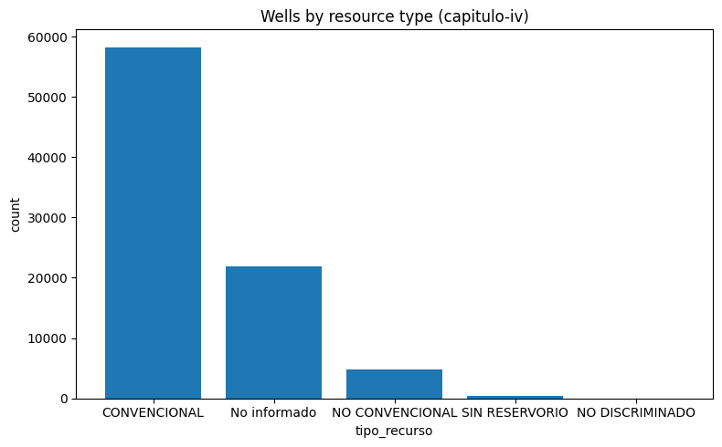
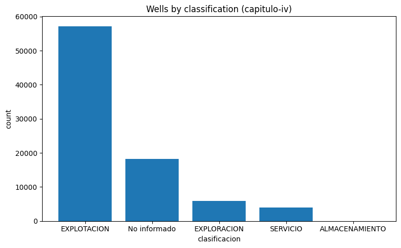
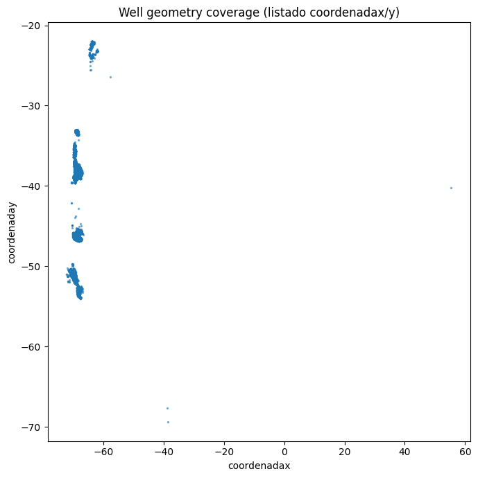
